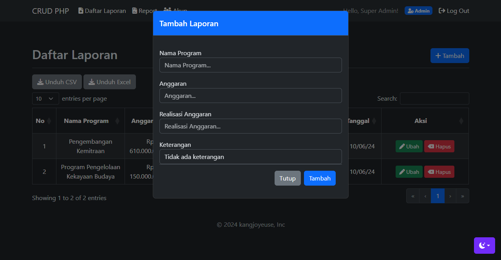
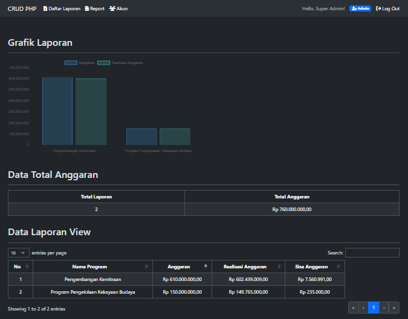

# Program CRUD Laporan

## Description
Projek dibuat untuk  memenuhi tugas besar basis data

## To-do
- [x] Sistem CRUD
- [x] Memiliki 2 akses (Admin dan Operator)
- [x] Menggunakan fungsi lanjutan mysql (View, Sum)
- [x] Memiliki fasilitas report
- [x] Memiliki fasilitas backup and restore
- [x] Dark Mode

## Tampilan Sekilas Program






## Database!
Masukan perintah SQL berikut
```
CREATE TABLE `akun` (
  `id_akun` int NOT NULL AUTO_INCREMENT,
  `nama_akun` varchar(100) NOT NULL,
  `username` varchar(100) NOT NULL,
  `email` varchar(50) NOT NULL,
  `password` varchar(100) NOT NULL,
  `level` varchar(2) NOT NULL,
  PRIMARY KEY (`id_akun`)
)

INSERT INTO akun VALUES("33","Super Admin","superadmin","superadmin@gmail.com","1234567","1");
INSERT INTO akun VALUES("35","Bayumas","bayu","bayu@gmail.com","123","2");

CREATE TABLE `laporan` (
  `id_laporan` int NOT NULL AUTO_INCREMENT,
  `nama_program` varchar(100) CHARACTER SET utf8mb4 COLLATE utf8mb4_0900_ai_ci DEFAULT NULL,
  `anggaran` varchar(50) DEFAULT NULL,
  `realisasi_anggaran` varchar(50) DEFAULT NULL,
  `rasio_realisasi_anggaran` varchar(50) DEFAULT NULL,
  `keterangan` varchar(50) DEFAULT NULL,
  `tanggal` timestamp NOT NULL,
  PRIMARY KEY (`id_laporan`)
)
```


> segala konfigurasi terdapat di folder config dan level 1 sebagai admin